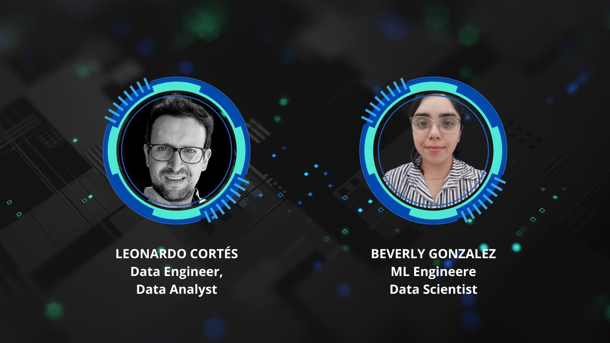

# c20-62-ft-data-bi

Group 62 Data BI Repository: Data Analysis Project with Microsoft Fabric (Azure Data Stack)

Overview 📝
This project aims to develop a comprehensive framework addressing key aspects of data engineering, data analysis, visualization, and machine learning model development within the Steam Community, using Microsoft Fabric (Azure Data Stack). The framework is designed to optimize the collection, processing, and analysis of data related to user behavior, gaming trends, and interactions within the Steam community. Additionally, it includes a comparative analysis of gaming data across other popular platforms such as Nintendo and PlayStation. The insights derived from this analysis will provide valuable support for strategic decision-making, including new game development, marketing strategy optimization, and enhancing user experience on the platform.

## Project Structure

| Folder/File              | Description                                                                                  |
| ------------------------ | -------------------------------------------------------------------------------------------- |
| **/data**                | Folder that stores datasets and files used by the Analysis,  Dashboard and ML models.                              |
| **/Notebooks**           | Folder containing Jupyter notebooks used for ETL, EDA and feature engineering processes |
| **/Images**              | Folder containing relevant and illustrative images for the analysis project. |
| **/Docs**              | Folder containing LaTex and PDF files (in English and Spanish) with the documentation carried out during each stage of the project, as well as a report with the final analysis and the project conclusions report.|
| **requirements.txt**     | File listing dependencies and libraries required to run the project.                           |
| **gitignore**            | File specifying folders and files to be ignored by version control (git).                      |
| **LICENSE**              | MIT LICENSE - File specifying the terms under which the source code is shared.                 |
| **functions.py**         | Python file with functions to deploy in the main file 'app-py' |
| **app.py**              | Main Python file serving as an entry point for the application, defining Model configuration and execution|
| **README.md**            | Main project documentation in English.                                                         |
| **README_ESP.md**        | Main project documentation in Spanish.                                                         |

## Authors

  

| Name                     | Rol                                       | |                |
| ------------------------ | ----------------------------------------- | -------------------------------- |--------------------------------|
| **Leonardo Cortés**      | Project Manager (PM), Data Engineer, Data Analyst   |[leocortes85](https://github.com/leocortes85/)  |[Leonardo Cortés Zambrano](https://www.linkedin.com/in/leonardo-cort%C3%A9s-zambrano/)
| **Beverly Gonzalez**      | ML Engineer and Data Scientist           |[licette32](https://github.com/licette32/) |[Beberly Gonzalez](https://www.linkedin.com/in/beverly-j-l-gonzalez-c/)|

